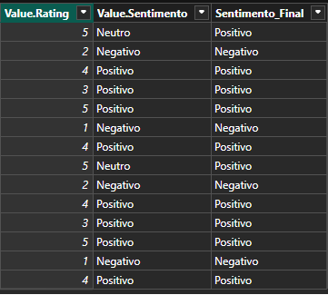

# Dashboard de Análise de Avaliações com Power BI e Python

## Descrição
Este projeto realiza a análise de sentimento de avaliações de produtos de um e-commerce fictício. O objetivo é classificar os comentários dos clientes como Positivos, Neutros ou Negativos, combinando a análise de texto do Python com regras de negócio baseadas na nota da avaliação, e apresentar os insights em um dashboard interativo no Power BI.

## Funcionalidades
- **Análise de Avaliacao em Português:** Utiliza a biblioteca `leia-br` para interpretar o sentimento do texto.
- **Regras de Negócio Híbridas:** Implementa uma lógica no Power Query onde notas 4 e 5 são sempre "Positivas" e notas 1 e 2 são sempre "Negativas", usando a IA apenas para os casos de 3 estrelas.
- **Dashboard Interativo:** Permite a filtragem dos resultados por produto, visualizando a distribuição de sentimentos e a nota média de forma dinâmica.

## O Dashboard Final

## Tecnologias Utilizadas
- **Power BI:** Para modelagem de dados, criação das regras de negócio e visualização.
- **Python 3:** Para o processamento de linguagem natural (NLP).
  - **Pandas:** Para manipulação de dados.
  - **LeIA-BR:** Para a análise de sentimento em português.
- **Git & GitHub:** Para controle de versão e documentação.

## Desafios e Aprendizados
Durante este projeto, enfrentei desafios reais como o tratamento de erros em scripts Python integrados ao Power BI, a necessidade de usar bibliotecas específicas para o idioma português (`LeIA-BR` ao invés do `TextBlob` padrão) e a importância de corrigir os tipos de dados para a correta aplicação das regras de negócio. O maior aprendizado foi a combinação de uma solução de IA com regras de negócio explícitas para criar um modelo mais robusto e confiável do que qualquer uma das abordagens usadas isoladamente.
